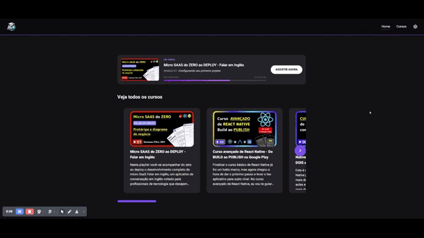
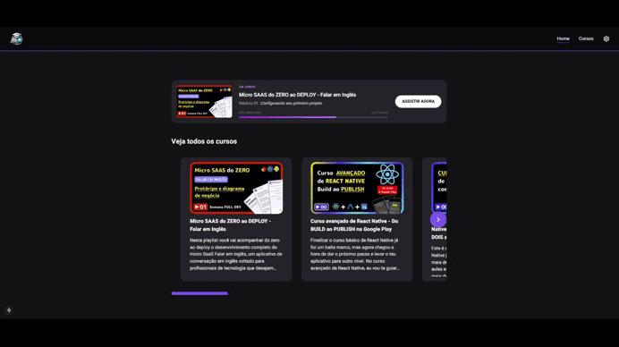

# YouCourse

YouCourse é uma plataforma de aulas personalizada que tem como objetivo proporcionar uma experiência de aprendizado mais limpa, organizada e focada, reduzindo distrações comuns em plataformas tradicionais de vídeo.

A proposta é oferecer um ambiente minimalista, onde o usuário pode consumir conteúdos educacionais com mais concentração e clareza.

## Tecnologias utilizadas

- Next.js  
- TypeScript  
- TailwindCSS  
- YouTube Data API

## 🎥 Demo




## Sobre o projeto

o YouCourse é um projeto de estudo que foi desenvolvido com foco em aprimorar as seguintes habilidades:

- Utilização do TailwindCSS para construção de interfaces rápidas e consistentes  
- Aplicação da abordagem mobile-first  
- Consumo de APIs externas (YouTube)  
- Estruturação de aplicações com Next.js  

A plataforma consome dados da API do YouTube para exibir cursos e aulas, organizando o conteúdo de forma mais amigável para o aprendizado.

## Funcionalidades atuais

- Listagem de cursos  
- Visualização de aulas  
- Interface limpa e focada no conteúdo  
- Design responsivo (mobile-first)




## Status do projeto

- Em desenvolvimento
  
## Próximos passos

- Completar a integração das páginas com a API  
- Implementar geração de páginas estáticas (SSG) com Next.js  
- Salvar o progresso de aulas (Keep Watching) no localStorage  

## Como rodar o projeto

```bash
# Clone o repositório
git clone https://github.com/seu-usuario/youcourse.git

# Acesse a pasta
cd youcourse

# Instale as dependências
npm install

# Rode o projeto
npm run dev

